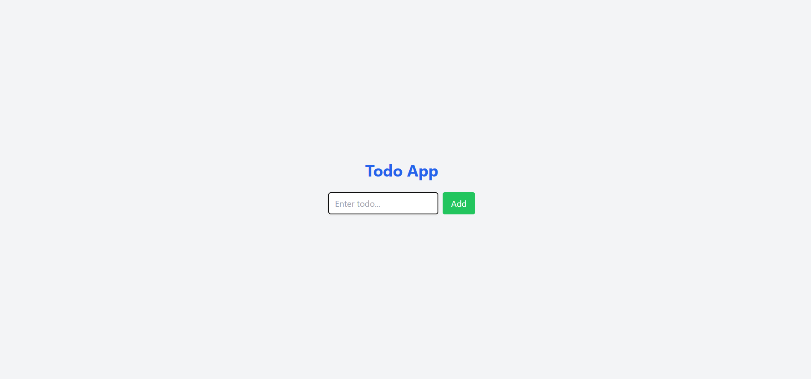

## 📝 Project: MERN Todo App

A simple full-stack todo list built using MongoDB, Express, React, and Node.js.

### 🔧 Features:
- Add/Delete Todos
- REST API with Express
- Connected to MongoDB Atlas

### 🚀 Tech Stack:
- Frontend: React, Axios
- Backend: Node.js, Express
- Database: MongoDB Atlas

### 📷 Screenshots:



### ▶️ Local Setup:
```bash
git clone https://github.com/FizzahNasir/full-mern-todo.git
cd backend && npm install && npm start
cd frontend && npm install && npm start
